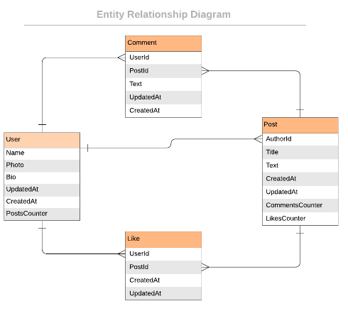

<a name="readme-top"></a>


<div align="center">
  <!-- You are encouraged to replace this logo with your own! Otherwise you can also remove it. -->


  <h3><b>Blog App</b></h3>

</div>

<!-- TABLE OF CONTENTS -->

# 📗 Table of Contents

- [📖 About the Project](#about-project)
  - [🛠 Built With](#built-with)
    - [Tech Stack](#tech-stack)
    - [Key Features](#key-features)
- [💻 Getting Started](#getting-started)
  - [Setup](#setup)
  - [Prerequisites](#prerequisites)
  - [Usage](#usage)
  - [Run tests](#run-tests)

- [👥 Authors](#authors)
- [🔭 Future Features](#future-features)
- [🤝 Contributing](#contributing)
- [⭐️ Show your support](#support)
- [🙏 Acknowledgements](#acknowledgements)
- [❓ FAQ (OPTIONAL)](#faq)
- [📝 License](#license)

<!-- PROJECT DESCRIPTION -->

# 📖 [Blog App] <a name="about-project"></a>

>This is a blog app which uses ruby on rails for its backend, user can login, make blog posts and like and make comments on the blogPosts. It aslo uses posgres database to store the data.
Here is the ERD for the project



## 🛠 Built With <a name="built-with"></a>

### Tech Stack <a name="tech-stack"></a>


<details>
  <summary>Server</summary>
  <ul>
    <li><a href="https://rubyonrails.org/">Ruby on rails</a></li>
  </ul>
</details>


<details>
<summary>Database</summary>
  <ul>
    <li><a href="https://www.postgresql.org/">PostgreSQL</a></li>
  </ul>
</details>

<!-- Features -->

### Key Features <a name="key-features"></a>


- **User Login**
- **Make a blog post**
- **LIke and leave a Comment**

<p align="right">(<a href="#readme-top">back to top</a>)</p>


<!-- GETTING STARTED -->

## 💻 Getting Started <a name="getting-started"></a>


To get a local copy up and running, follow these steps.

### Prerequisites

In order to run this project you need:

To have instakked ruby on your computer
To have installed rails

```sh
 gem install rails
```


### Setup

Clone this repository to your desired folder:


```sh
  git clone https://github.com/george827/BlogApp.git
  
```
```sh
  cd BLogApp
  rails db:create
  rails db:migrate
```


### Usage

To run the project, execute the following command:

```sh
  rails server
```

### Run tests

To run tests, run the following command:


```sh
  bin/rails test test/models/
```


<p align="right">(<a href="#readme-top">back to top</a>)</p>

<!-- AUTHORS -->

## 👥 George Kinyanjui <a name="authors"></a>

👤 **George Kinyanjui**

- GitHub: [@george827](https://github.com/george827)
- Twitter: [George Kinyanjui](https://twitter.com/geok8376)
- LinkedIn: [George Kinyanjui](https://www.linkedin.com/in/georgekinyanjui/)

👤 **Chimezie Asouzu**

- GitHub: [@Shegy28](https://github.com/shegy28)
- Twitter: [@Shegy28](https://twitter.com/twitterhandle)
- LinkedIn: [LinkedIn](https://www.linkedin.com/in/chimezie-asouzu-67704224a/)

👤 **Faranosh Amini**

- GitHub: [@githubhandle](https://github.com/FaranoshAmini)
- Twitter: [@twitterhandle](https://twitter.com/Faranosh_Amini)
- LinkedIn: [LinkedIn](https://www.linkedin.com/in/faranosh-amini-9b925b23a/)


<p align="right">(<a href="#readme-top">back to top</a>)</p>

<!-- FUTURE FEATURES -->

## 🔭 Future Features <a name="future-features"></a>

- [ ] **User to add post**
- [ ] **user to like and comment on post**
- [ ] **delete post**

<p align="right">(<a href="#readme-top">back to top</a>)</p>

<!-- CONTRIBUTING -->

## 🤝 Contributing <a name="contributing"></a>

Contributions, issues, and feature requests are welcome!

Feel free to check the [issues page](https://github.com/george827/BlogApp/issues).

<p align="right">(<a href="#readme-top">back to top</a>)</p>

<!-- SUPPORT -->

## ⭐️ Show your support <a name="support"></a>


If you like this project you can give it a star ⭐️

<p align="right">(<a href="#readme-top">back to top</a>)</p>

<!-- ACKNOWLEDGEMENTS -->

## 🙏 Acknowledgments <a name="acknowledgements"></a>


I would like to thank microverse for providing all the resources to buld this


<p align="right">(<a href="#readme-top">back to top</a>)</p>

<!-- LICENSE -->

## 📝 License <a name="license"></a>

This project is [MIT](https://github.com/george827/BlogApp/blob/dev/LICENSE) licensed.


<p align="right">(<a href="#readme-top">back to top</a>)</p>